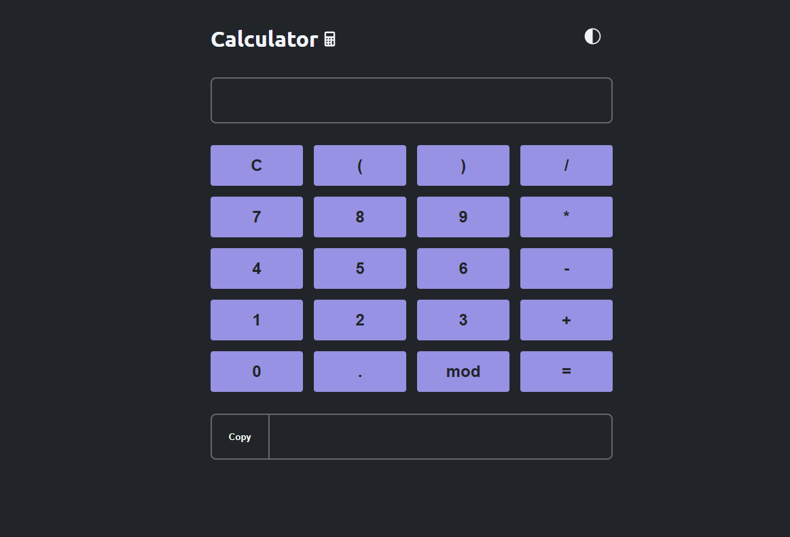

<h1 align="center"> Calculator </h1>

Calculator é uma aplicação simples para realizar operações matemáticas 

  <a href="#-tecnologias">Tecnologias</a>&nbsp;&nbsp;&nbsp;|&nbsp;&nbsp;&nbsp;
  <a href="#-projeto">Projeto</a>&nbsp;&nbsp;&nbsp;|&nbsp;&nbsp;&nbsp;
  <a href="#memo-licença">Licença</a>

  

 

  

## 🚀 Tecnologias

Esse projeto foi desenvolvido com as seguintes tecnologias:

- Html
- Css 
- JavaScript
- Git e Github

## 💻 Projeto

Calculator é uma calculadora desenvolvida para realizar opeações simples de matemática. 
Contendo a funcionalidade de trocar o tema de acordo com a preferência do usuário.

## :memo: Licença

Esse projeto está sob a licença MIT.

---

Feito com ♥ by Marcos Brhemem 👋